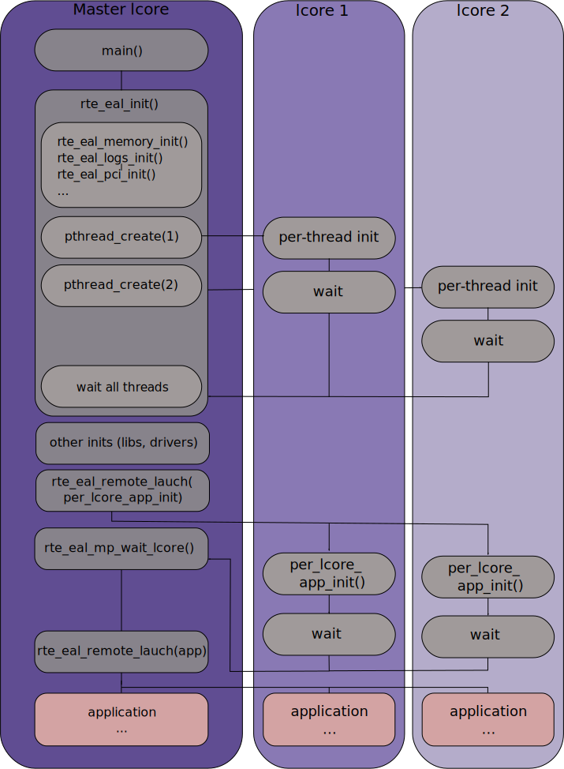

..  BSD LICENSE
    Copyright(c) 2010-2014 Intel Corporation. All rights reserved.
    All rights reserved.

    Redistribution and use in source and binary forms, with or without
    modification, are permitted provided that the following conditions
    are met:

    * Redistributions of source code must retain the above copyright
    notice, this list of conditions and the following disclaimer.
    * Redistributions in binary form must reproduce the above copyright
    notice, this list of conditions and the following disclaimer in
    the documentation and/or other materials provided with the
    distribution.
    * Neither the name of Intel Corporation nor the names of its
    contributors may be used to endorse or promote products derived
    from this software without specific prior written permission.

    THIS SOFTWARE IS PROVIDED BY THE COPYRIGHT HOLDERS AND CONTRIBUTORS
    "AS IS" AND ANY EXPRESS OR IMPLIED WARRANTIES, INCLUDING, BUT NOT
    LIMITED TO, THE IMPLIED WARRANTIES OF MERCHANTABILITY AND FITNESS FOR
    A PARTICULAR PURPOSE ARE DISCLAIMED. IN NO EVENT SHALL THE COPYRIGHT
    OWNER OR CONTRIBUTORS BE LIABLE FOR ANY DIRECT, INDIRECT, INCIDENTAL,
    SPECIAL, EXEMPLARY, OR CONSEQUENTIAL DAMAGES (INCLUDING, BUT NOT
    LIMITED TO, PROCUREMENT OF SUBSTITUTE GOODS OR SERVICES; LOSS OF USE,
    DATA, OR PROFITS; OR BUSINESS INTERRUPTION) HOWEVER CAUSED AND ON ANY
    THEORY OF LIABILITY, WHETHER IN CONTRACT, STRICT LIABILITY, OR TORT
    (INCLUDING NEGLIGENCE OR OTHERWISE) ARISING IN ANY WAY OUT OF THE USE
    OF THIS SOFTWARE, EVEN IF ADVISED OF THE POSSIBILITY OF SUCH DAMAGE.

.. _Environment_Abstraction_Layer:

Environment Abstraction Layer
=============================

The Environment Abstraction Layer (EAL) is responsible for gaining access to low-level resources such as hardware and memory space.
It provides a generic interface that hides the environment specifics from the applications and libraries.
It is the responsibility of the initialization routine to decide how to allocate these resources
(that is, memory space, PCI devices, timers, consoles, and so on).

Typical services expected from the EAL are:

*   DPDK Loading and Launching:
    The DPDK and its application are linked as a single application and must be loaded by some means.

*   Core Affinity/Assignment Procedures:
    The EAL provides mechanisms for assigning execution units to specific cores as well as creating execution instances.

*   System Memory Reservation:
    The EAL facilitates the reservation of different memory zones, for example, physical memory areas for device interactions.

*   PCI Address Abstraction: The EAL provides an interface to access PCI address space.

*   Trace and Debug Functions: Logs, dump_stack, panic and so on.

*   Utility Functions: Spinlocks and atomic counters that are not provided in libc.

*   CPU Feature Identification: Determine at runtime if a particular feature, for example, Intel® AVX is supported.
    Determine if the current CPU supports the feature set that the binary was compiled for.

*   Interrupt Handling: Interfaces to register/unregister callbacks to specific interrupt sources.

*   Alarm Functions: Interfaces to set/remove callbacks to be run at a specific time.

EAL in a Linux-userland Execution Environment
---------------------------------------------

In a Linux user space environment, the DPDK application runs as a user-space application using the pthread library.
PCI information about devices and address space is discovered through the /sys kernel interface and through a module called igb_uio.
Refer to the UIO: User-space drivers documentation in the Linux kernel. This memory is mmap'd in the application.

The EAL performs physical memory allocation using mmap() in hugetlbfs (using huge page sizes to increase performance).
This memory is exposed to DPDK service layers such as the :ref:`Mempool Library <Mempool_Library>`.

At this point, the DPDK services layer will be initialized, then through pthread setaffinity calls,
each execution unit will be assigned to a specific logical core to run as a user-level thread.

The time reference is provided by the CPU Time-Stamp Counter (TSC) or by the HPET kernel API through a mmap() call.

Initialization and Core Launching
~~~~~~~~~~~~~~~~~~~~~~~~~~~~~~~~~

Part of the initialization is done by the start function of glibc.
A check is also performed at initialization time to ensure that the micro architecture type chosen in the config file is supported by the CPU.
Then, the main() function is called. The core initialization and launch is done in rte_eal_init() (see the API documentation).
It consist of calls to the pthread library (more specifically, pthread_self(), pthread_create(), and pthread_setaffinity_np()).

.. _pg_figure_2:

**Figure 2. EAL Initialization in a Linux Application Environment**

.. image3_png has been replaced

|linuxapp_launch|

.. note::

    Initialization of objects, such as memory zones, rings, memory pools, lpm tables and hash tables,
    should be done as part of the overall application initialization on the master lcore.
    The creation and initialization functions for these objects are not multi-thread safe.
    However, once initialized, the objects themselves can safely be used in multiple threads simultaneously.

Multi-process Support
~~~~~~~~~~~~~~~~~~~~~

The Linuxapp EAL allows a multi-process as well as a multi-threaded (pthread) deployment model.
See chapter 2.20
:ref:`Multi-process Support <Multi-process_Support>` for more details.

Memory Mapping Discovery and Memory Reservation
~~~~~~~~~~~~~~~~~~~~~~~~~~~~~~~~~~~~~~~~~~~~~~~

The allocation of large contiguous physical memory is done using the hugetlbfs kernel filesystem.
The EAL provides an API to reserve named memory zones in this contiguous memory.
The physical address of the reserved memory for that memory zone is also returned to the user by the memory zone reservation API.

.. note::

    Memory reservations done using the APIs provided by the rte_malloc library are also backed by pages from the hugetlbfs filesystem.
    However, physical address information is not available for the blocks of memory allocated in this way.

Xen Dom0 support without hugetbls
~~~~~~~~~~~~~~~~~~~~~~~~~~~~~~~~~

The existing memory management implementation is based on the Linux kernel hugepage mechanism.
However, Xen Dom0 does not support hugepages, so a new Linux kernel module rte_dom0_mm is added to workaround this limitation.

The EAL uses IOCTL interface to notify the Linux kernel module rte_dom0_mm to allocate memory of specified size,
and get all memory segments information from the module,
and the EAL uses MMAP interface to map the allocated memory.
For each memory segment, the physical addresses are contiguous within it but actual hardware addresses are contiguous within 2MB.

PCI Access
~~~~~~~~~~

The EAL uses the /sys/bus/pci utilities provided by the kernel to scan the content on the PCI bus.

To access PCI memory, a kernel module called igb_uio provides a /dev/uioX device file
that can be mmap'd to obtain access to PCI address space from the application.
It uses the uio kernel feature (userland driver).

Per-lcore and Shared Variables
~~~~~~~~~~~~~~~~~~~~~~~~~~~~~~

.. note::

    lcore refers to a logical execution unit of the processor, sometimes called a hardware *thread*.

Shared variables are the default behavior.
Per-lcore variables are implemented using *Thread Local Storage* (TLS) to provide per-thread local storage.

Logs
~~~~

A logging API is provided by EAL.
By default, in a Linux application, logs are sent to syslog and also to the console.
However, the log function can be overridden by the user to use a different logging mechanism.

Trace and Debug Functions
^^^^^^^^^^^^^^^^^^^^^^^^^

There are some debug functions to dump the stack in glibc.
The rte_panic() function can voluntarily provoke a SIG_ABORT,
which can trigger the generation of a core file, readable by gdb.

CPU Feature Identification
~~~~~~~~~~~~~~~~~~~~~~~~~~

The EAL can query the CPU at runtime (using the rte_cpu_get_feature() function) to determine which CPU features are available.

User Space Interrupt and Alarm Handling
~~~~~~~~~~~~~~~~~~~~~~~~~~~~~~~~~~~~~~~

The EAL creates a host thread to poll the UIO device file descriptors to detect the interrupts.
Callbacks can be registered or unregistered by the EAL functions for a specific interrupt event
and are called in the host thread asynchronously.
The EAL also allows timed callbacks to be used in the same way as for NIC interrupts.

.. note::

    The only interrupts supported by the DPDK Poll-Mode Drivers are those for link status change,
    i.e. link up and link down notification.

Blacklisting
~~~~~~~~~~~~

The EAL PCI device blacklist functionality can be used to mark certain NIC ports as blacklisted,
so they are ignored by the DPDK.
The ports to be blacklisted are identified using the PCIe* description (Domain:Bus:Device.Function).

Misc Functions
~~~~~~~~~~~~~~

Locks and atomic operations are per-architecture (i686 and x86_64).

Memory Segments and Memory Zones (memzone)
------------------------------------------

The mapping of physical memory is provided by this feature in the EAL.
As physical memory can have gaps, the memory is described in a table of descriptors,
and each descriptor (called rte_memseg ) describes a contiguous portion of memory.

On top of this, the memzone allocator's role is to reserve contiguous portions of physical memory.
These zones are identified by a unique name when the memory is reserved.

The rte_memzone descriptors are also located in the configuration structure.
This structure is accessed using rte_eal_get_configuration().
The lookup (by name) of a memory zone returns a descriptor containing the physical address of the memory zone.

Memory zones can be reserved with specific start address alignment by supplying the align parameter
(by default, they are aligned to cache line size).
The alignment value should be a power of two and not less than the cache line size (64 bytes).
Memory zones can also be reserved from either 2 MB or 1 GB hugepages, provided that both are available on the system.

