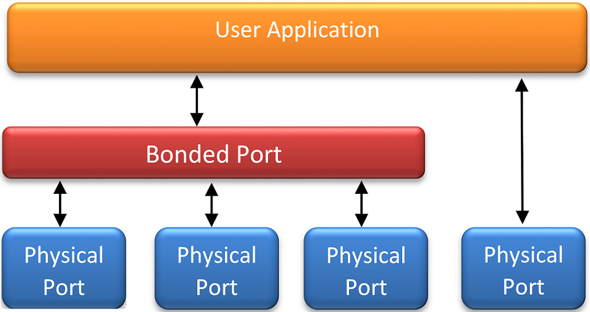

..  BSD LICENSE
    Copyright(c) 2010-2014 Intel Corporation. All rights reserved.
    All rights reserved.

    Redistribution and use in source and binary forms, with or without
    modification, are permitted provided that the following conditions
    are met:

    * Redistributions of source code must retain the above copyright
    notice, this list of conditions and the following disclaimer.
    * Redistributions in binary form must reproduce the above copyright
    notice, this list of conditions and the following disclaimer in
    the documentation and/or other materials provided with the
    distribution.
    * Neither the name of Intel Corporation nor the names of its
    contributors may be used to endorse or promote products derived
    from this software without specific prior written permission.

    THIS SOFTWARE IS PROVIDED BY THE COPYRIGHT HOLDERS AND CONTRIBUTORS
    "AS IS" AND ANY EXPRESS OR IMPLIED WARRANTIES, INCLUDING, BUT NOT
    LIMITED TO, THE IMPLIED WARRANTIES OF MERCHANTABILITY AND FITNESS FOR
    A PARTICULAR PURPOSE ARE DISCLAIMED. IN NO EVENT SHALL THE COPYRIGHT
    OWNER OR CONTRIBUTORS BE LIABLE FOR ANY DIRECT, INDIRECT, INCIDENTAL,
    SPECIAL, EXEMPLARY, OR CONSEQUENTIAL DAMAGES (INCLUDING, BUT NOT
    LIMITED TO, PROCUREMENT OF SUBSTITUTE GOODS OR SERVICES; LOSS OF USE,
    DATA, OR PROFITS; OR BUSINESS INTERRUPTION) HOWEVER CAUSED AND ON ANY
    THEORY OF LIABILITY, WHETHER IN CONTRACT, STRICT LIABILITY, OR TORT
    (INCLUDING NEGLIGENCE OR OTHERWISE) ARISING IN ANY WAY OUT OF THE USE
    OF THIS SOFTWARE, EVEN IF ADVISED OF THE POSSIBILITY OF SUCH DAMAGE.

Link Bonding Poll Mode Driver Library
=====================================

In addition to Poll Mode Drivers (PMDs) for physical and virtual hardware,
Intel® DPDK also includes a pure-software library that
allows physical PMD's to be bonded together to create a single logical PMD.

|link_bonding|

The Link Bonding PMD library(librte_pmd_bond) supports bonding of groups of physical ports of the same speed (1GbE, 10GbE and 40GbE) and
duplex to provide similar the capabilities to that found in Linux bonding driver to allow the aggregation of multiple (slave) NICs
into a single logical interface between a server and a switch.
The new bonded PMD will then process these interfaces based on the mode of operation specified to provide support for features
such as redundant links, fault tolerance and/or load balancing.

The librte_pmd_bond library exports a C API which provides an API for the creation of bonded devices
as well as the configuration and management of the bonded device and its slave devices.

.. note::

    The Link Bonding PMD Library is enabled by default in the build configuration files,
    the library can be disabled by setting CONFIG_RTE_LIBRTE_PMD_BOND=n and recompiling the Intel® DPDK.

Link Bonding Modes Overview
---------------------------

Currently the Link Bonding PMD library supports 4 modes of operation:

*   **Round-Robin (Mode 0):**
    This mode provides load balancing and fault tolerance by transmission of packets
    in sequential order from the first available slave device through the last.
    Packets are bulk dequeued from devices then serviced in round-robin manner.

*   **Active Backup (Mode 1):**
    In this mode only one slave in the bond is active at any time, a different slave becomes active if,
    and only if, the primary active slave fails,
    thereby providing fault tolerance to slave failure.
    The single logical bonded interface's MAC address is externally visible on only one NIC (port)
    to avoid confusing the network switch.

*   **Balance XOR (Mode 2):**
    This mode provides load balancing based on transmit packets based on the selected XOR transmission policy and fault tolerance.
    The default policy (layer2) uses a simple XOR calculation on the packet source / destination MAC address to select the slave to transmit on.
    Alternate transmission policies supported are layer 2+3, this uses the IP source and destination addresses in the calculation of the slave port and
    the final supported policy is layer 3+4, this uses IP source and destination addresses as well as the UDP source and destination port.

*   **Broadcast (Mode 3):**
    This mode provides fault tolerance by transmission of packets on all slave ports.

Implementation Details
----------------------

The librte_pmd_bond onded device are compatible with the Ethernet device API exported by the Ethernet PMDs described in the *Intel® DPDK API Reference*.

The Link Bonding Library supports the creation of bonded devices at application startup time during EAL initialization using the
--vdev option as well as programmatically via the C API rte_eth_bond_create function.

Bonded devices support the dynamical addition and removal of slave devices using
the rte_eth_bond_slave_add / rte_eth_bond_slave_remove APIs.

After a slave device is added to a bonded device slave is stopped using
rte_eth_dev_stop and the slave reconfigured using rte_eth_dev_configure the RX and TX queues are also reconfigured
using rte_eth_tx_queue_setup / rte_eth_rx_queue_setup with the parameters use to configure the bonding device.

Requirements / Limitations
~~~~~~~~~~~~~~~~~~~~~~~~~~

The current implementation only supports physical devices of the same type, speed and duplex to be added as slaves.
The bonded device inherits these values from the first active slave added to the bonded device
and then all further slaves added to the bonded device must match these parameters.

A bonding device must have a minimum of one slave before the bonding device itself can be started.

Like all other PMD, all functions exported by a PMD are lock-free functions that are assumed
not to be invoked in parallel on different logical cores to work on the same target object.

It should also be noted that the PMD receive function should not be invoked directly on a slave devices after they have
been to a bonded device since packets read directly from the slave device will no longer be available to the bonded device to read.

Configuration
~~~~~~~~~~~~~

Link bonding devices are created using the rte_eth_bond_create API
which requires a unique device name, the bonding mode,
and the socket Id to allocate the bonding device's resources on.
The other configurable parameters for a bonded device are its slave devices, its primary slave,
a user defined MAC address and transmission policy to use if the device is balance XOR mode.

Slave Devices
^^^^^^^^^^^^^

Bonding devices support up to a maximum of RTE_MAX_ETHPORTS slave devices of the same speed and duplex.
Ethernet devices can be added as a slave to a maximum of one bonded device.
Slave devices are reconfigured with the configuration of the bonded device on being added to a bonded device.

The bonded also guarantees to return the MAC address of the slave device to its original value of removal of a slave from it.

Primary Slave
^^^^^^^^^^^^^

The primary slave is used to define the default port to use when a bonded device is in active backup mode.
A different port will only be used if, and only if, the current primary port goes down.
If the user does not specify a primary port it will default to being the first port added to the bonded device.

MAC Address
^^^^^^^^^^^

The bonded device can be configured with a user specified MAC address,
this address will be inherited by the some/all slave devices depending on the operating mode.
If the device is in active backup mode then only the primary device will have the user specified MAC,
all other slaves will retain their original MAC address.
In mode 0, 2, and 3 all slaves devices are configure with the bonded devices MAC address.

If a user defined MAC address is not defined then the bonded device will default to using the primary slaves MAC address.

Balance XOR Transmit Policies
^^^^^^^^^^^^^^^^^^^^^^^^^^^^^

There are 3 supported transmission policies for bonded device running in Balance XOR mode. Layer 2, Layer 2+3, Layer 3+4.

*   **Layer 2:**   Ethernet MAC address based balancing is the default transmission policy for Balance XOR bonding mode.
    It uses a simple XOR calculation on the source MAC address and destination MAC address of the packet and
    then calculate the modulus of this value to calculate the slave device to transmit the packet on.

*   **Layer 2 + 3:** Ethernet MAC address & IP Address based balancing uses a combination of source/destination MAC addresses and
    the source/destination IP addresses of the data packet to decide which slave port the packet will be transmitted on.

*   **Layer 3 + 4:**  IP Address & UDP Port based  balancing uses a combination of source/destination IP Address and
    the source/destination UDP ports of the packet of the data packet to decide which slave port the packet will be transmitted on.

All these policies support 802.1Q VLAN Ethernet packets, as well as IPv4, IPv6 and UDP protocols for load balancing.

Using Link Bonding Devices
--------------------------

The librte_pmd_bond library support two modes of device creation, the libraries export full C API or
using the EAL command line to statically configure link bonding devices at application startup.
Using the EAL option it is possible to use link bonding functionality transparently without specific knowledge of the libraries API,
this can be used, for example, to add bonding functionality, such as active backup,
to an existing application which has no knowledge of the link bonding C API.

Using the Poll Mode Driver from an Application
~~~~~~~~~~~~~~~~~~~~~~~~~~~~~~~~~~~~~~~~~~~~~~

Using the librte_pmd_bond libraries API it is possible to dynamicall create and manage link bonding device from within any application.
Link bonding device are created using the rte_eth_bond_create API which requires a unqiue device name,
the link bonding mode to initial the device in and finally the socket Id which to allocate the devices resources onto.
After successful creation of a bonding device it must be configured using the generic Ethernet device configure API rte_eth_dev_configure
and then the RX and TX queues which will be used must be setup using rte_eth_tx_queue_setup / rte_eth_rx_queue_setup.

Slave devices can be dynamically added and removed from a link bonding device using the rte_eth_bond_slave_add / rte_eth_bond_slave_remove
APIs but at least one slave device must be added to the link bonding device before it can be started using rte_eth_dev_start.

The link status of a bonded device is dictated by that of its slaves, if all slave device link status are down or
if all slaves are removed from the link bonding device then the link status of the bonding device will go down.

It is also possible to configure / query the configuration of the control parameters of a bonded device using the provided APIs
rte_eth_bond_mode_set/get, rte_eth_bond_primary_set/get, rte_eth_bond_mac_set/reset and rte_eth_bond_xmit_policy_set/get.

Using Link Bonding Devices from the EAL Command Line
~~~~~~~~~~~~~~~~~~~~~~~~~~~~~~~~~~~~~~~~~~~~~~~~~~~~

Link bonding devices can be created at application startup time using the --vdev EAL command line option.
The device name must start with the eth_bond prefix followed by numbers or letters. The name must be unique for each device.
Each device can have multiple options arranged in a comma separated list.
Multiple devices definitions can be arranged by calling the --vdev option multiple times.
Device names and bonding options must be separated by commas as shown below:

.. code-block:: console

    $RTE_TARGET/app/testpmd -c f -n 4 --vdev 'eth_bond0,bond_opt0=..,bond opt1=..'--vdev 'eth_bond1,bond _opt0=..,bond_opt1=..'

Link Bonding EAL Options
^^^^^^^^^^^^^^^^^^^^^^^^

There are multiple ways of definitions that can be assessed and combined as long as the following two rules are respected:

*   A unique device name, in the format of eth_bondX is provided,
    where X can be any combination of numbers and/or letters,
    and the name is no greater than 32 characters long.

*   A least one slave device is provided with for each bonded device definition.

*   The operation mode of the bonded device being created is provided.

The different options are:

*   mode: Integer value defining the bonding mode of the device.
    Currently supports modes 0,1,2,3 (round-robin, active backup, balance, and broadcast).

        mode=2

*   slave: Defines the PMD device which will be added as slave to the bonded device.
    This option can be selected multiple time, for each device to be added as a slave.
    Physical devices should be specified using their PCI address, in the format domain:bus:devid.function

        slave=0000:0a:00.0,slave=0000:0a:00.1

*   primary: Optional parameter which defines the primary slave port,
    is used in active backup mode to select the primary slave for data TX/RX if it is available.
    The primary port also is used to select the MAC address to use when it is not defined by the user.
    This defaults to the first slave added to the device if it is specified.
    The primary device must be a slave of the bonded device.

        primary=0000:0a:00.0

*   socket_id: Optional parameter used to select which socket on a NUMA device the bonded devices resources will be allocated on.

        socket_id=0

*   mac: Optional parameter to select a MAC address for link bonding device, this overrides the value of the primary slave device.

        mac=00:1e:67:1d:fd:1d

*   xmit_policy: Optional parameter which defines the transmission policy when the bonded device is in  balance mode.
    If not user specified this defaults to l2 (layer 2) forwarding,
    the other transmission policies available are l23 (layer 2+3) and l34 (layer 3+4)

        xmit_policy=l2

Examples of Usage
^^^^^^^^^^^^^^^^^

Create a bonded device in round robin mode with two slaves specified by their PCI address:

.. code-block:: console

    $RTE_TARGET/app/testpmd -c '0xf' -n 4 --vdev 'eth_bond0,mode=0, slave=0000:00a:00.01,slave=0000:004:00.00' -- --port-topology=chained

Create a bonded device in round robin mode with two slaves specified by their PCI address and an overriding MAC address:

.. code-block:: console

    $RTE_TARGET/app/testpmd -c '0xf' -n 4 --vdev 'eth_bond0,mode=0, slave=0000:00a:00.01,slave=0000:004:00.00,mac=00:1e:67:1d:fd:1d' -- --port-topology=chained

Create a bonded device in active backup mode with two slaves specified, and a primary slave specified by their PCI addresses:

.. code-block:: console

    $RTE_TARGET/app/testpmd -c '0xf' -n 4 --vdev 'eth_bond0,mode=1, slave=0000:00a:00.01,slave=0000:004:00.00,primary=0000:00a:00.01' -- --port-topology=chained

Create a bonded device in balance mode with two slaves specified by their PCI addresses, and a transmission policy of layer 3 + 4 forwarding:

.. code-block:: console

    $RTE_TARGET/app/testpmd -c '0xf' -n 4 --vdev 'eth_bond0,mode=2, slave=0000:00a:00.01,slave=0000:004:00.00,xmit_policy=l34' -- --port-topology=chained

